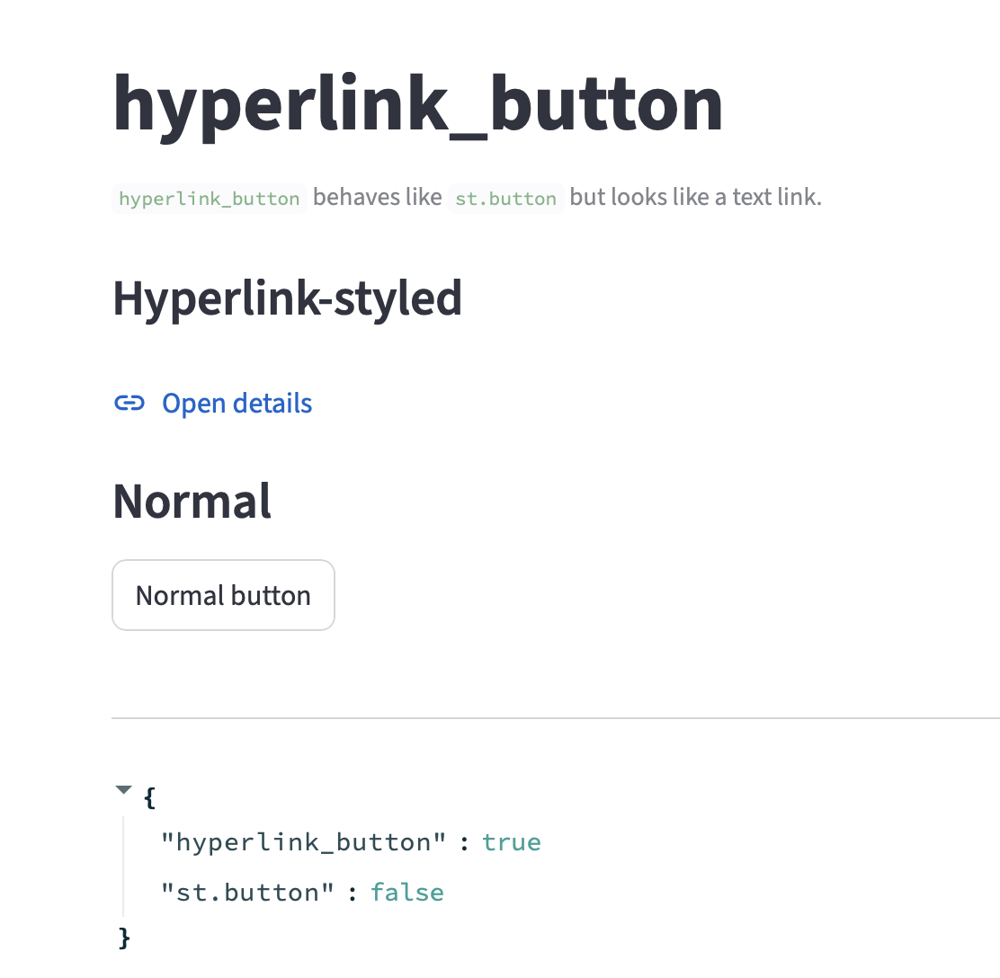

- Building from scratch Streamlit component, no human intervention beyond launching the long-horizon agent
- It works! Looks good, sample app is minimal and OK

- Found 2 bugs, major one with clicks not alaways working (incorrect state management) and minor when font was different from the rest of the app (not using Streamlit themes)
- ~2h execution with no user intervention
- Total Cost $4.32
- Orcthestrator Cost: $3.59
- Leverage (net tokens)	2.45x
  - Each orchestrator token yielded 2.45 tokens of subagent work
- Total tokens processed (including cached reads): 6,819.3K
- Tests run, contain Playwright (GUI), e2e stramlit and unit tests - as expected (and kind requestyed)
- Docs look good, not bloated
- Orchestrator model: GPT-5.2-High
- Ignored docker use, the idea was to use it as a sanbox, have all work done inside container using it as a sandbox
  - Didn't check it properly before starting, yet asked in GOAL
  - After work was done reported it had issues ineracting with docker
- Early on the model used opencode-subagents yet from ~30% of conversations it went on implementing the element by itself
- The task is both simple and hard 
 - simple in scope and size, just creat a custom button control
 - Hard cause it is 2 stack, Python for streamlit component and React/npm for the fronet-end component bundled by streamlit component
 - Anoter non-trivial part is UI, nneed to inspect

 ## opencode-subagent stats

 ```
 DONE AGENTS
NAME                      STATUS    PID  STARTED              COMPLETED             RUNTIME  MSG  DIALOG  FULL
build/docs                done    74497  2026-02-11 10:44:58  2026-02-11 10:46:01  00:01:03    2     171     -
build/frontend-react      done    73921  2026-02-11 10:44:48  2026-02-11 10:51:14  00:06:25   21    1585     -
build/python-wrapper      done    73552  2026-02-11 10:44:38  2026-02-11 10:45:44  00:01:06   11    1880     -
build/tests               done    74210  2026-02-11 10:44:53  2026-02-11 10:54:37  00:09:43    9       0     -
plan/architecture         done    45004  2026-02-11 10:29:01  2026-02-11 10:31:23  00:02:21   19    1215     -
plan/pypi-manual          done    45427  2026-02-11 10:29:09  2026-02-11 10:29:54  00:00:45    4   15157     -
plan/testing              done    45300  2026-02-11 10:29:06  2026-02-11 10:30:24  00:01:18    4   11422     -
research/components-docs  done    45128  2026-02-11 10:29:04  2026-02-11 10:30:51  00:01:47   12   32708     -
```

## opencode total stats
```
┌────────────────────────────────────────────────────────┐
│                       OVERVIEW                         │
├────────────────────────────────────────────────────────┤
│Sessions                                             11 │
│Messages                                            202 │
│Days                                                  1 │
└────────────────────────────────────────────────────────┘

┌────────────────────────────────────────────────────────┐
│                    COST & TOKENS                       │
├────────────────────────────────────────────────────────┤
│Total Cost                                        $4.32 │
│Avg Cost/Day                                      $4.32 │
│Avg Tokens/Session                               632.3K │
│Median Tokens/Session                             90.0K │
│Input                                            548.3K │
│Output                                           171.0K │
│Cache Read                                         6.1M │
│Cache Write                                           0 │
└────────────────────────────────────────────────────────┘

┌────────────────────────────────────────────────────────┐
│                      MODEL USAGE                       │
├────────────────────────────────────────────────────────┤
│ azure/gpt-5.2                                          │
│  Messages                                          117 │
│  Input Tokens                                   100.5K │
│  Output Tokens                                  194.2K │
│  Cache Read                                       5.5M │
│  Cache Write                                         0 │
│  Cost                                          $3.5860 │
├────────────────────────────────────────────────────────┤
│ azure/gpt-5.2-codex                                    │
│  Messages                                           43 │
│  Input Tokens                                   102.7K │
│  Output Tokens                                   31.1K │
│  Cache Read                                     345.0K │
│  Cache Write                                         0 │
│  Cost                                          $0.6759 │
├────────────────────────────────────────────────────────┤
│ opencode/gpt-5-nano                                    │
│  Messages                                           19 │
│  Input Tokens                                   250.6K │
│  Output Tokens                                   47.0K │
│  Cache Read                                     223.5K │
│  Cache Write                                         0 │
│  Cost                                          $0.0000 │
├────────────────────────────────────────────────────────┤
│ azure/gpt-5-mini                                       │
│  Messages                                            8 │
│  Input Tokens                                    94.5K │
│  Output Tokens                                   18.4K │
│  Cache Read                                      17.7K │
│  Cache Write                                         0 │
│  Cost                                          $0.0610 │
└────────────────────────────────────────────────────────┘

┌────────────────────────────────────────────────────────┐
│                      TOOL USAGE                        │
├────────────────────────────────────────────────────────┤
│ bash               ████████████████████ 110 (43.5%)    │
│ apply_patch        ██████████            56 (22.1%)    │
│ read               ████████              47 (18.6%)    │
│ glob               █████                 28 (11.1%)    │
│ webfetch           █                      7 ( 2.8%)    │
│ grep               █                      2 ( 0.8%)    │
│ task               █                      2 ( 0.8%)    │
│ skill              █                      1 ( 0.4%)    │
└────────────────────────────────────────────────────────┘
```

## Orchestratort Session

```
New session - 2026-02-11T10:19:11.617Z
Context
88,632 tokens
22% used
$3.31 spent
```

```
┌────────────────────────────────────────────────────────┐
│                       OVERVIEW                         │
├────────────────────────────────────────────────────────┤
│Sessions                                              3 │
│Messages                                            120 │
│Days                                                  1 │
└────────────────────────────────────────────────────────┘

┌────────────────────────────────────────────────────────┐
│                    COST & TOKENS                       │
├────────────────────────────────────────────────────────┤
│Total Cost                                        $3.59 │
│Avg Cost/Day                                      $3.59 │
│Avg Tokens/Session                                 1.9M │
│Median Tokens/Session                             74.1K │
│Input                                            100.5K │
│Output                                           108.1K │
│Cache Read                                         5.5M │
│Cache Write                                           0 │
└────────────────────────────────────────────────────────┘

┌────────────────────────────────────────────────────────┐
│                      MODEL USAGE                       │
├────────────────────────────────────────────────────────┤
│ azure/gpt-5.2                                          │
│  Messages                                          117 │
│  Input Tokens                                   100.5K │
│  Output Tokens                                  194.2K │
│  Cache Read                                       5.5M │
│  Cache Write                                         0 │
│  Cost                                          $3.5860 │
└────────────────────────────────────────────────────────┘

┌────────────────────────────────────────────────────────┐
│                      TOOL USAGE                        │
├────────────────────────────────────────────────────────┤
│ bash               ████████████████████  98 (54.1%)    │
│ apply_patch        ██████                34 (18.8%)    │
│ read               █████                 26 (14.4%)    │
│ glob               ████                  20 (11.0%)    │
│ task               █                      2 ( 1.1%)    │
│ skill              █                      1 ( 0.6%)    │
└────────────────────────────────────────────────────────┘
```

## Tokenomics

| Metric | Value | What it means |
|---|---|---|
| **Leverage (net tokens)** | 2.45x | Each orchestrator token yielded 2.45 tokens of subagent work |
| **Subagent share (net)** | 71.0% | Subagents did most of the unique token work |
| **Subagent share (gross)** | 16.3% | But gross is inflated by orchestrator cache reads |
| **Cost per net M tokens (orch)** | $17.22 | Premium model = expensive coordination |
| **Cost per net M tokens (subs)** | $1.43 | Cheap models doing the heavy lifting |
| **Cache bloat (orchestrator)** | 26.4x | Conversation re-reading overhead |

**Bottom line**: By net effort, the subagents did ~71% of the unique work for ~17% of the cost. The orchestrator's expense comes from re-reading context (cache bloat), not from generating a lot of new tokens. The leverage ratio of 2.45x is decent but not spectacular — a sign that the orchestrator intervened heavily (it did ~30%+ of implementation itself, as noted in the review).

## How Tokens Actually Work

- **Input tokens**: The prompt sent to the model (your message + system prompt + context). The model *reads* these.
- **Output tokens**: What the model *generates* — actual reasoning, code, tool calls.
- **Cache Read tokens**: Previously seen input tokens that were cached and re-sent cheaply. The model still *reads* them, but you pay less. They represent **repeated context** (e.g., the full conversation history re-sent each turn).

So the **total tokens processed** (i.e., total "work" the model did) is:

$$\text{Total Work} = \text{Input} + \text{Cache Read} + \text{Output}$$

Cache reads are still *read by the model* — they're just cheaper to bill. From an **effort** standpoint, the model still processes them. But from a **novelty/unique work** standpoint, cache reads are redundant — they're the same context re-sent.

This gives us two useful metrics:

### 1. **Gross Effort** (total tokens processed)
Everything the model touched:

| Component | Input | Cache Read | Output | **Gross Total** |
|---|---|---|---|---|
| Orchestrator | 100.5K | 5,500K | 108.1K | **5,708.6K** |
| Subagents | 447.8K | 600K | 62.9K | **1,110.7K** |
| **All** | **548.3K** | **6,100K** | **171.0K** | **6,819.3K** |

By gross effort, subagents did **1.1M / 6.8M = 16.3%** of total work. But this is misleading because the orchestrator's 5.5M cache reads are just re-reading the same growing conversation each turn.

### 2. **Net Effort** (unique/new tokens only)
Strip out cache reads — what was *new* information flowing in and out:

$$\text{Net Effort} = \text{Input (non-cached)} + \text{Output}$$

| Component | Input (fresh) | Output | **Net Total** |
|---|---|---|---|
| Orchestrator | 100.5K | 108.1K | **208.6K** |
| Subagents | 447.8K | 62.9K | **510.7K** |
| **All** | **548.3K** | **171.0K** | **719.3K** |

By net effort: subagents did **510.7K / 719.3K = 71.0%** of unique token work.

### 3. **Output-Only Effort** (what was actually *produced*)
If you only care about what each component *generated* (code, reasoning, decisions):

| Component | Output | Share |
|---|---|---|
| Orchestrator | 108.1K | **63.2%** |
| Subagents | 62.9K | **36.8%** |

But wait — the orchestrator's 108.1K output includes a ton of coordination chatter (planning, dispatching tasks, reviewing). The subagents' 62.9K is mostly *artifacts* (code, tests, docs).

---

## The Ratios That Actually Make Sense

### **Leverage Ratio** (Net Effort)
$$\text{Leverage} = \frac{\text{Subagent Net Effort}}{\text{Orchestrator Net Effort}} = \frac{510.7K}{208.6K} = 2.45$$

The orchestrator generated **2.45x its own weight** in subagent work. This is the "multiplication factor" — for every token of orchestration, 2.45 tokens of actual work happened.

### **Overhead Ratio** (Cost per Net Token)
$$\text{Orchestrator: } \frac{\$3.59}{208.6K} = \$17.22 \text{ per M tokens}$$
$$\text{Subagents: } \frac{\$0.73}{510.7K} = \$1.43 \text{ per M tokens}$$

The orchestrator costs **12x more per net token** than subagents. This is the price of using a premium model for coordination.

### **Cache Bloat Ratio**
$$\frac{\text{Orchestrator Cache Read}}{\text{Orchestrator Net Effort}} = \frac{5,500K}{208.6K} = 26.4x$$

The orchestrator re-read its context **26.4x** for every unit of new work. Long multi-turn conversations cause this — every new message re-sends the full history.

---
